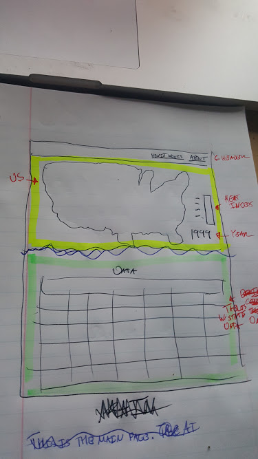
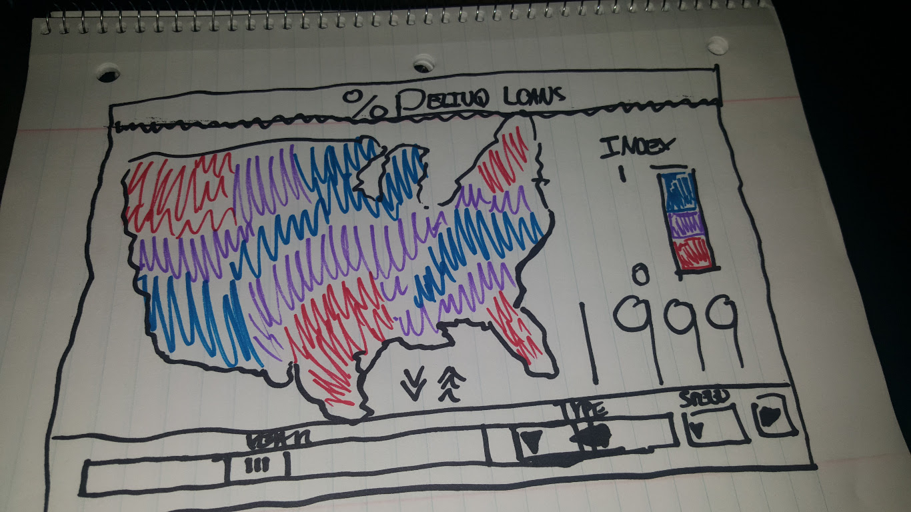
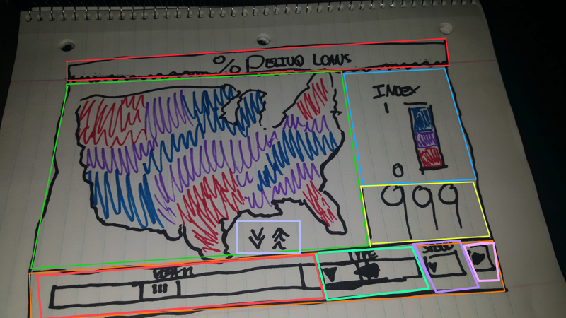
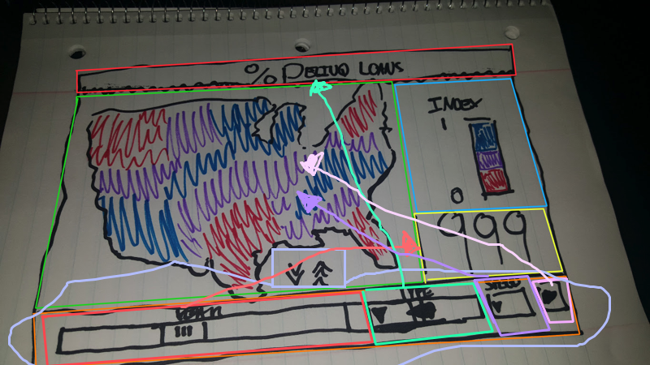
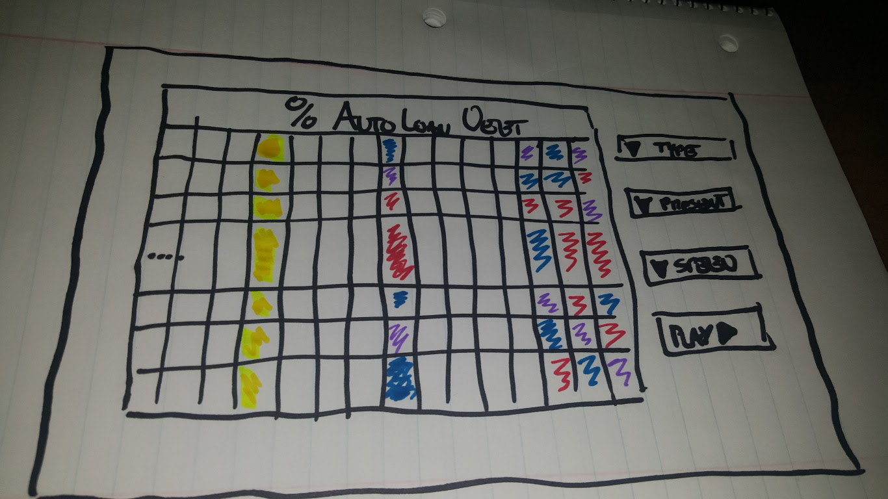
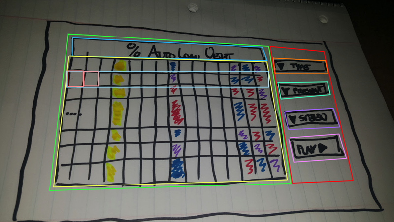
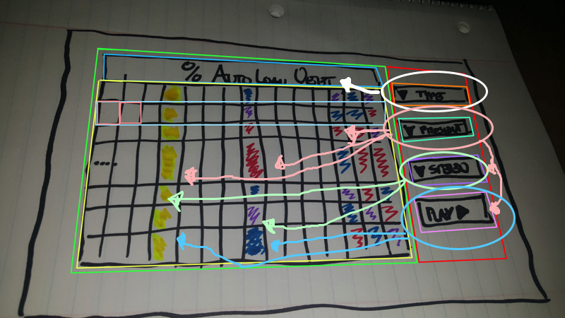

# General Design Document
------

# High Level
From 1999 to 2016 there is data on the different types of Debt. This MEAN Stack project will use D3.js to display that data in a visually appealing fashion,using a map of the United States and a table. And the site should be responsive in order to accomodate mobile phones and tablets alike. 

# Pages
This project should have about 2-3 pages. The Main Page, How it works, and maybe an About Us Page. 

So the main page will consist of a couple elements, a header, the Animated US Map, the Animated Table, and a footer. 

The How it Works can just be a technical explanation or two of how some of the cooler things were done.

## Main Page
### Header
Simple Header that will contain the links to the other pages. The header should be a fixed to the top of the page.

### Animated US Map

The Animated US Map is one of the mediums that will be used to show the user the State Debt Data (SDD). Each State will be represented on the Map.
Each State will be color coded depending on amount of debt that state has. The Heat Index (HI) will indicate to the user what color means what. The HI will reside to the right of the map. Below the HI will be the year. Slider?

#### Component Breakdown
(Note: Nested List Items Are Considered Child Elements)

* Title (Top, Strawberry)
* US Map (Middle, Green)
  * Drawer Toggle (Below Map; Lavender)
* Heat Index (Far Right, Sky Blue)
* Year (Far Right; Lower, Yellow)
* Drawer (Bottom, Orange)
  * Year Slider (Far Left, Strawberry)
  * Debt Type DD (Second from Left, Sea Green)
  * Speed Toggle (Third from Left, Purple)
  * Playback Button (Far Right, Pink)

#### Component Relationship
(Note: Some Relationships will not be displayed in the image, as concepts evolved over time)

* Drawer Toggle -> Drawer  (Below Map; Lavender)

  The Drawer Toggle begans as a button style to be a down arrow, When the user clicks the down arrow, the drawer will pop down. Once the drawer is exposed, the Drawer Toggle button is then styled to be an up arrow. When the user clicks the up arrow, the drawer will dissapear, and the Up Arrow becomes a down arrow again.
  
  * Secondary Actions
  
* Year Slider -> Year; US Map (Drawer; Strawberry)

  The Slider will directly affect the year and map animation simultaneously through manual control. The Slider will begin at 1999 and end at 2016. As the Slider is moved from left to right, the colors in US Map will change according to the year that is displayed.
  * Secondary Actions
  
* Debt Type DD -> Header; US Map (Drawer; Sea Green)

  The Debt Type DD contains a list of the different type of debts, once one is chosen, the header will change to reflect the selection. And the US Map will adjust to prepare for itself to playback that debt type.
  
* Speed DD -> US Map (Drawer; Purple)

  The Speed DD contains a list of speeds, once one is chosen, the US Map will update its speed for the next playback.
  
* Playback -> US Map (Drawer; Pink)
  
  The Playback is a button that once pressed will trigger the US Map Animation based on the type and speed options that were selected.
  * Secondary Action
    
    The playback button is pressed, the slider should slide over accordingly.

#### The Animation

From 1999 to 2016 there is data on the different types of Debt. The site will show that data on the map using the colors which 
will change as the years go up or down. The color transitions should relatively smooth from year to year. The year should be animated as well, such as a scroll up down.

### Animated Table 

The Animated table is the second medium that will be used to show the user the SDD. The Table will have the States as the rows and the Years as the columns. There will be a drop down that has the different types of debt and the population. Depending on what is selected in the drop down, the table will display that data. 

To help the user read the data easier, table will color code the data in different ways. 
* Highlights By Year Using Timed Intervals
  * Color Coating much like the states
  * Plain Yellow
* Show and Hide States 
  * Fade States In And Out as need to help user focus.
  * Fuzzy Hide

#### Component Breakdown

#### Component Breakdown

#### The Animation

### Footer
It will contain the Bibliographic citation of the source we pulled this data from. 

